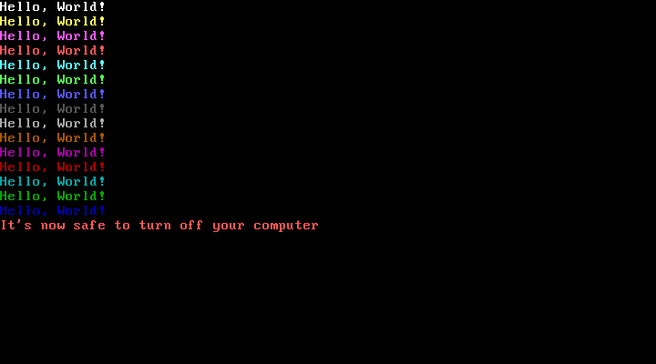

# Boot sector application collection
A collection of simple boot sector applications written in NASM for IBM
PC-compatibles.

# Why?
I got a little bored with my current big project and wanted to refresh my
assembly knowledge too.

# Usage
  - `./start.sh [application name]` will assemble the app and run it in QEMU
  - `./flash.sh [application name] [block device]` will assemble the app and the
    bootstrap script and flash them to the specified block device

# System requirements
80386 and a VGA-compatible graphics adapter (i.e. anything that was made in the
last 30 years).

# Application list

## Screensaver (`screensaver`)
Displays a simple animation in 320x200 256-color mode

## Dino (`dino`)
Built-in Chrome dino game in 320x200 256-color mode

## Hello, World! (`hello_world`)
Displays "Hello, World!" in the 16 VGA colors. Originally written live for a
low-level introductory lecture at [undef.space](https://undef.club).

